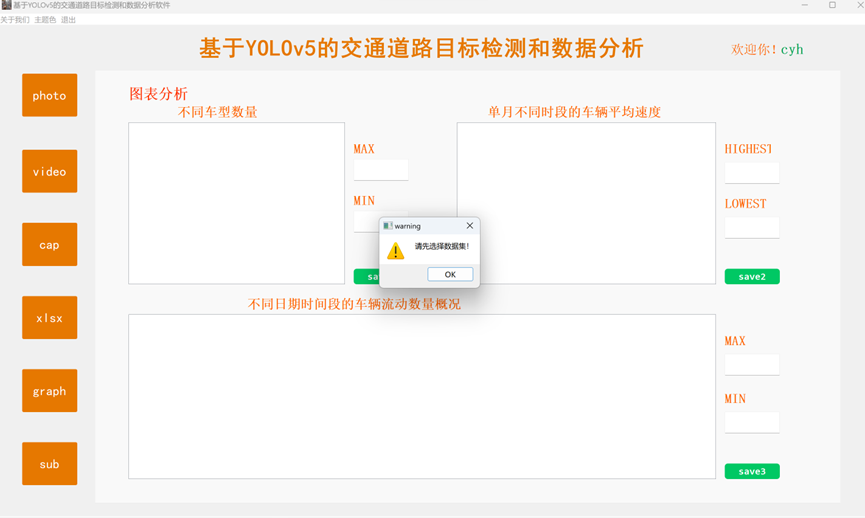

<div align="center">
  <h2>基于YOLOv5的交通道路目标检测和数据分析软件</h2>
  <p>
    <a align="center" href="https://ultralytics.com/yolov5" target="_blank">
      </a>
  </p>
</div>


## <div align="center"> ⭐ 项目功能 </div>
### 交通物体检测
本项目基于YOLOv5框架，能够对交通物体进行检测，对图片能检测到物体并用锚框进行标注展示。对于视频则是对每一帧进行物体检测或实例分割的分析，同样使用锚框进行标注，最终生成的物体检测视频能实时追踪物体并用不同颜色框进行标注展示。此外，还添加了摄像头实时检测物体的功能。
### 交通数据分析
本项目能够对导入的交通数据集进行数据分析，包括不同车型出现频率，不同时段早晚高峰期时间分析等，以折线图，饼状图等方式直观呈现数据，利于清楚看出数据总体分布。


## <div align="center"> ⭐ 项目部署 </div>

在Pycharm中打开该项目，配置一个venv虚拟环境后，直接按下面命令安装依赖即可：
```bash
pip install -r requirements.txt
```

## <div align="center"> ⭐ 注意事项 </div>

- main.py为本项目程序入口文件，软件的所有功能都写在这个文件中，前端页面设计在 `ui` 目录下
- 本程序中连接了数据库，需要自己配置与本地的数据库进行连接，如不需要数据库的话，只需把main.py的173行位置下的以下代码注释掉并调整缩进即可：
```python
# 显示登录对话框
login_dialog = LoginDialog()
result = login_dialog.exec_()
# 检查登录对话框返回结果
if result == QDialog.Accepted:
# 下文记得向前缩进
```
- main.py的849行位置记得更改成本项目目录：
```python
base_path = "D:/MyCode/public_project/yolov5-traffic-app/"
```


## <div align="center"> ⭐ 具体使用说明 </div>

### 登录注册
用户打开本软件时，首先需要进行登录注册，一开始需要先注册一个账号，并在登录页进行账号密码输入进行登录。

本软件采用mysql数据库对用户的信息进行存储管理。其中规定用户名不能重复，以保证账号的唯一性。在注册登录时有一些基本的校验，用于判断账号是否存在，以及每个账号对应的密码是否匹配等等。只有注册成功，并输入正确的账号密码，用户才能成功登录此软件。


<div align="center">（登录注册页面）</div>

 


<div align="center">（合法校验后的相应提示）</div>
 

<div align="center">（mysql后台数据存储显示）</div>

### 首页
用户登录成功后，按下提示框中的ok键，便会直接跳转到本软件并呈现首页，也就是侧边栏的第一项：photo图片物体检测。在该页面中的右上方会显示当前登录用户的账号名。具体布局如下图所示： 
 

<div align="center">（软件布局介绍）</div>

### 侧边栏
侧边总共有6选项卡，类似于导航栏的功能，点击即可跳转到不同页面。除了第一个photo栏带有图片检测的功能之外，其他5个选项会跳转到不同的子页面，对应着视频检测，数据分析处理等功能。 

### 图片物体检测
用户可以点击左下角的select按钮，会弹出一个文件管理器，用户通过选择对应路径下的图片进行导入，导入成功后会在左侧显示导入图片，之后点击右下角的show按钮，将开始对选择的图片进行物体检测，模型训练完检测成功后，右边的白框中会显示处理好后的图片。其中对每个物体根据不同类别进行了不同颜色的锚框标注，每个物体上面会显示检测的置信度，值越高代表对物体的预测正确的把握值越高。

在此页面最右侧，可以对置信度conf，IOU进行参数调整，还可以指定要检测的class类别，不指定的话默认会检测出所有类别的物体。其中，指定的conf越小，即识别的精确度要求降低，模型大概率会识别出更多的物体。在右下侧位置，能对图片中检测出的物体进行计数：显示类别以及对应的物体数。
 

<div align="center">（弹出文件管理器选择图片）</div>
 

<div align="center">（默认物体识别）</div>
 

<div align="center">（调参并指定具体类别的物体识别）</div>

### 视频物体检测
点击侧边栏的第二个选项卡video，便能跳转到第二个页面，对视频进行物体检测分析。类似的，用户可以点击左下角的select按钮，在弹出的窗口中进行视频文件选择，选择好后要，左侧框会自动对视频进行播放。当用户点击右下角的show按钮后，模型开始训练，对视频的每一帧画面进行物体检测，同时进行相关锚框和置信度的标注，最终整合成处理好的视频，在右侧框中进行播放展示。效果如下：


<div align="center">（默认物体检测效果）</div>

同样地，在右侧区还能对训练进行调参处理，可以设置置信度，IOU值和指定要检测的分类。当置信度越低时，所识别出的物体数和种类数可能相对变多。设置class类别页可以对某一种具体物体进行检测，调参后具体效果如下：


<div align="center">（调参后检测效果）</div>

其中，页面右下侧也有物体计数显示框，不过由于是视频，每时每刻的类别及物体数都会实时变化，因此点击show时，该显示框会以一定速率显示出每帧对应的类别及物体数，实现动态识别检测的效果。

### 摄像头实时检测物体
当用户点击carema后，电脑的摄像头设备将开启并进行实时检测，模型拿到实时数据进行训练预测，将检测到的物体以锚框的方式实时标注并显示到一个frame实时窗口中。每个锚框上面会显示对应的类别以及置信度，效果如下图：


### 数据导入
用户可以将需要数据处理的交通数据集导入，支持xlsx和csv格式。点击select按钮后将弹出文件管理器，选择对应路径下的数据集即可在该页面中间显示该数据集的全貌。同时在右侧会显示该数据集基本信息，包括选择的数据集情况，行数和列数。 具体展示效果如下：


<div align="center">（选择文件页面）</div>
 

<div align="center">（数据集展示）</div>

若指定某一天的数据集，则显示框会优先显示该数据子集，具体日期会显示，行数也会相应改变，效果如下：


<div align="center">（数据具体子集展示）</div>

### 数据总览分析
点击侧边栏第5个选项卡，即可查看导入数据的总览分析。

若用户还没进行相关数据的导入，则在该页面不会展示相关图表等信息，而是弹出一个提示框，提示用户选择数据集，效果如下：

 
<div align="center">（弹框提示）</div>

若用户选择了数据集，则该页面会显示出三个图表，分别展示该数据集的车辆分布饼状图、不同日期的车辆平均速度变化情况折线图和总时间段的流动车辆数变化情况折线图。通过图表的方式，用户可具体查看所选数据集的数据分布。


<div align="center">（多种图表和数据展示）</div>

### 数据子图具体分析
在数据选择中，若用户在数据导入时，没指定具体的子图，在该页面不会展示相关图表等信息，而是弹出一个提示框，提示用户选择数据子集，效果如下：


若用户选择了子图，即某一天具体的交通检测数据集，在该子页面上会显示相应的图信息。包括一天中车辆分布，车辆高峰期，车辆数量和平均车速的变化情况等等，效果如下：


<div align="center">（多种图表和数据展示）</div>

### 图表导出为图片
在每个图表的周围，都有一个save按钮，可以将对应的图像进行重命名并保存导出为图片，利于用户存储记录一些包含关键数据的图表，效果展示如下：


<div align="center">（命名并保存为图片）</div>
 

<div align="center">（成功导出图片展示）</div>

### 软件简介与版本
菜单栏里，“关于”按钮的下拉框中，可选introduction来查看本软件的简要介绍，也可选择version来查看软件当前版本相关信息。


效果如下：


<div align="center">（introduction软件介绍）</div>


<div align="center">（version版本信息）</div>

### 软件主题色
在软件最左上角的区域是菜单栏，用户可以选择主题。主题的下拉菜单里有4种软件主题色调供用户选择，点击不同按钮即可切换不同主题色。


以下是不同主题色的展示效果图：


<div align="center">（默认色调）</div>


<div align="center">（黑色调）</div>


<div align="center">（白色调）</div>


<div align="center">（蓝色调）</div>

### 退出程序
点击菜单栏中的退出，在弹出的下拉框中点击exit，或者点击页面右上角的×按钮，均可退出本程序。

